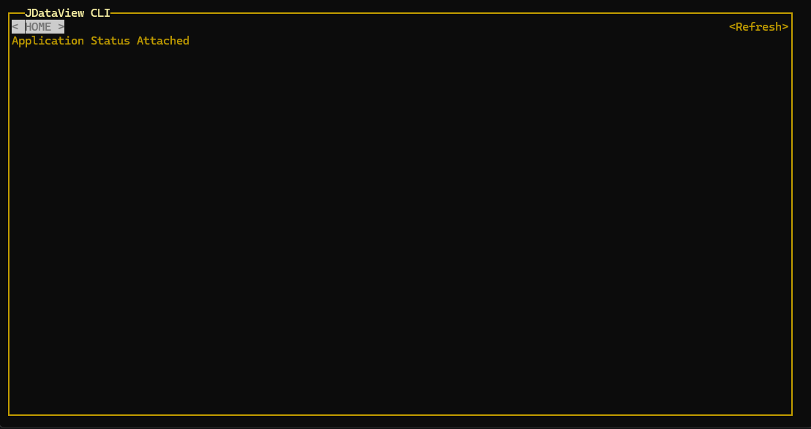
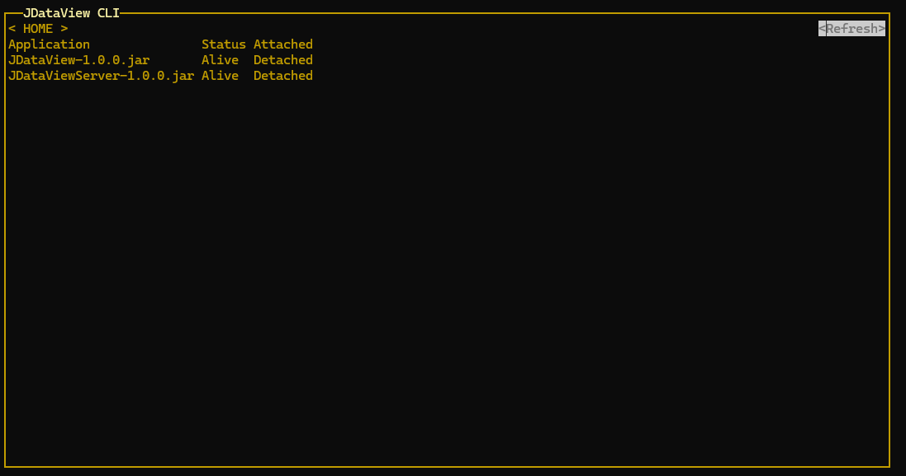
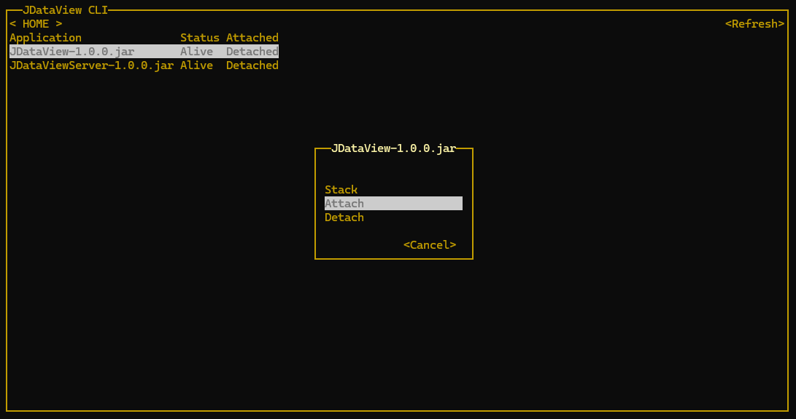
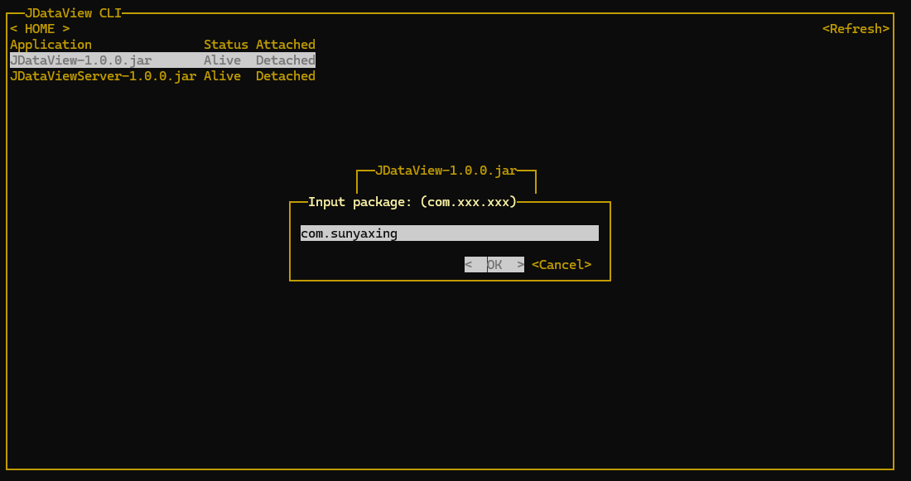
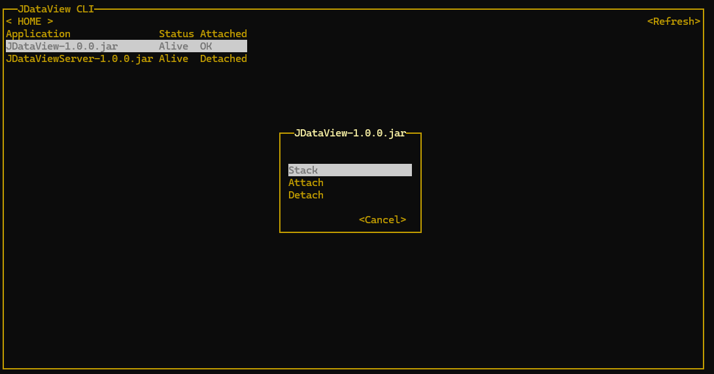

# JDataView

<p align="center">
  <strong>Linux 下 Java 应用可视化性能分析工具</strong>
</p>

## 📖 项目介绍

JDataView 是一款专为 Linux 环境设计的 Java 应用性能分析工具，基于 Java Agent 技术实现无侵入式的方法调用栈数据采集。通过 WebSocket 实时传输数据到服务端进行持久化与分析，并在前端以树形图的方式直观展示方法调用关系和耗时信息，帮助开发者快速定位性能瓶颈。

### ✨ 核心特性

- **无侵入式采集**：基于 Java Agent 技术，无需修改业务代码
- **实时数据传输**：通过 WebSocket 实时传输性能数据
- **可视化分析**：树形图展示方法调用栈和执行时间
- **持久化存储**：数据持久化到数据库，支持历史数据查询
- **包级别过滤**：支持按包前缀精准过滤需要分析的代码范围
- **无 JDK 依赖部署**：打包内置 JRE，简化服务器部署流程

## 🏗️ 技术架构

### 架构设计

```
┌─────────────────┐
│  目标 Java 应用  │
│  (被监控应用)    │
└────────┬────────┘
  ↑      │ 
  │      ↓
  │     ┌─────────────────┐
  │     │ JDataViewAgent  │ ← 数据采集层
  │     │  (方法拦截器)    │   - Byte Buddy 字节码增强
  │     │                 │   - 方法调用栈采集
  │     └────────┬────────┘   - 耗时统计
  │Agent 注入     │ WebSocket
  │              ↓
┌─────────────────┐
│JDataViewServer  │ ← 服务端
│  (Spring Boot)  │   - 数据持久化
│  (CLI)          │   - SH可视化
│                 │   - RESTful API
└────────┬────────┘   - 数据分析
         │ HTTP
         ↓
┌─────────────────┐
│   前端界面       │ ← 可视化层
│ (Quasar/Vue.js) │   - 应用管理
│                 │   - 线程列表
└─────────────────┘   - 调用树展示
```

### 模块说明

#### 1. [JDataViewAgent](JDataViewAgent)
**数据采集模块** - Java Agent 核心实现

- **技术栈**：Java、Byte Buddy
- **核心功能**：
  - 方法拦截与字节码增强
  - 调用栈数据采集（方法名、参数、返回值、耗时）
  - WebSocket 客户端，实时发送数据到服务端
  - 类注册与缓存管理
- **关键类**：
  - `JDataViewAgent`：Agent 入口，处理 premain
  - `ProfilingAdvice`：方法拦截通知
  - `JDataViewWebSocketClient`：WebSocket 客户端

#### 2. [JDataViewApi](JDataViewApi)
**数据模型模块** - 定义 Agent 与 Server 通信协议

- **核心功能**：
  - 定义数据传输对象（DTO）
  - 消息协议规范
  - 生命周期管理
- **关键类**：
  - `JDataViewMsg`：主消息体
  - `ClassRegistryMsg`：类注册消息
  - `ThreadSpace`：线程空间数据

#### 3. [JDataViewServer](JDataViewServer)
**服务端模块** - Spring Boot 应用

- **技术栈**：Spring Boot、WebSocket、H2/MySQL
- **核心功能**：
  - WebSocket 服务端，接收 Agent 数据
  - 数据持久化与查询
  - RESTful API 提供数据服务
  - 静态资源服务（前端页面）
  - CLI 命令行交互界面
- **关键组件**：
  - `AgentWs`：WebSocket 处理器
  - `AgentMsgService`：消息处理服务
  - `JavaAppController`：应用管理 API

#### 4. [font/dataview](font/dataview)
**前端模块** - Quasar 框架（Vue.js）

- **技术栈**：Vue.js、Quasar Framework、Vue Flow、Pnpm
- **核心功能**：
  - 应用列表管理
  - 线程列表展示
  - 方法调用树形图可视化（使用 Vue Flow）
  - 实时数据刷新
- **关键页面**：
  - `AppMgmtIndex.vue`：应用管理主页
  - `ThreadList.vue`：线程列表
  - `JDataPanel.vue`：调用栈可视化面板

#### 5. [app](app)
**测试应用** - 用于演示和测试 Agent 功能

- 提供示例业务代码
- 用于验证 Agent 注入和数据采集功能

## 🚀 快速开始

### 环境要求

- **操作系统**：Linux（推荐 CentOS 7+、Ubuntu 18.04+）
- **Java 版本**：目标应用需 JDK 17+
- **权限**：具备 attach 到目标 JVM 的权限

### 构建项目

#### 1. 克隆项目

```bash
git clone <repository-url>
cd JDataView
```

#### 2. 构建后端（Maven）

```bash
# 构建整个项目（包含所有模块）
mvn clean package

# 构建后会生成：target/JDataViewAll-1.0.0-noJdk.zip
```

#### 3. 构建前端（可选，已内置在 Server）

```bash
cd font/dataview
pnpm install
pnpm run build

# 构建产物会输出到：dist/spa
# 需将构建产物复制到 JDataViewServer/src/main/resources/static/
```

### 部署安装

#### 1. 解压安装包到根目录

```bash
# 上传 JDataViewAll-1.0.0-noJdk.zip 到服务器
unzip JDataViewAll-1.0.0-noJdk.zip -d /

# 安装后的目录结构：
# /opt/JDataView/
# ├── JDataViewServer-1.0.0.jar  (服务端主程序)
# ├── config/                    (配置文件)
# └── agent/                       (Agent)
#     ├── JDataViewAgent-1.0.0.jar   (Agent 包)
```

#### 2. 启动 JDataView Server

```bash
cd /opt/JDataView/
java -jar JDataViewServer-1.0.0.jar

# 默认会启动终端可视化界面
# 默认端口：8080
# 访问地址：http://localhost:8080
```

### 使用指南

#### 方式一：Web 界面操作

1. **访问 Web 界面**
   
   打开浏览器访问：`http://<server-ip>:8080`

2. **查看应用列表**
   
   - 点击「应用管理」进入应用列表页
   - 点击「刷新」按钮查看当前运行的 Java 应用

3. **Attach 到目标应用**
   
   - 选择目标应用，点击「Attach」
   - 输入要监控的包前缀（如：`com.example`）
   - 等待 Agent 注入完成

4. **查看方法调用栈**
   
   - 选择已注入的应用，点击「查看线程」
   - 触发业务操作（发起 HTTP 请求等）
   - 刷新线程列表，选择目标线程
   - 查看方法调用树形图和耗时信息

#### 方式二：CLI 命令行操作

1. **启动后进入 CLI 面板**
   
   

2. **刷新应用列表**
   
   - 选择右侧 `refresh` 按钮，按回车刷新
   
   

3. **Attach 应用**
   
   - 选择目标应用，按回车
   - 选择 `attach` 选项
   
   

4. **输入包前缀**
   
   - 输入要扫描的包前缀（如：`org.sunyaxing`）
   
   

5. **查看调用栈**
   
   - 等待注入完成后，选择应用，按回车
   - 选择 `stack` 选项
   
   

6. **查看线程数据**
   
   - 触发业务线程（发起请求等）
   - 选择 `refresh` 刷新线程列表
   
   

7. **查看方法耗时**
   
   - 选择目标线程，按回车即可查看详细的方法调用栈和耗时信息

### 测试示例

#### 使用测试应用 app 模块

```bash
# 1. 启动测试应用
cd app
mvn spring-boot:run

# 2. 发起测试请求
curl http://localhost:8080/test

# 3. 在 JDataView 中 attach 到该应用，查看调用栈
```

## 🔧 开发说明

### 项目结构

```
JDataView/
├── JDataViewAgent/          # Agent 模块（数据采集）
│   └── src/main/java/
│       └── org/sunyaxing/imagine/jdvagent/
│           ├── advices/              # 方法拦截通知
│           ├── cache/                # 类信息缓存
│           ├── sender/               # 数据发送器
│           └── JDataViewAgent.java   # Agent 入口
├── JDataViewApi/            # API 模块（数据模型）
│   └── src/main/java/
│       └── org/sunyaxing/imagine/jdataviewapi/data/
├── JDataViewServer/         # 服务端模块
│   └── src/main/
│       ├── java/.../jdataviewserver/
│       │   ├── cli/              # CLI 命令行界面
│       │   ├── controller/       # REST API 控制器
│       │   ├── service/          # 业务逻辑层
│       │   ├── entity/           # 数据实体
│       │   └── websocket/        # WebSocket 处理器
│       └── resources/
│           ├── static/           # 前端静态资源
│           └── application.yml   # 配置文件
├── font/dataview/           # 前端模块（Vue.js）
│   ├── src/
│   │   ├── pages/
│   │   │   ├── appmgmt/      # 应用管理页面
│   │   │   └── vueflow/      # 调用栈可视化
│   │   └── router/           # 路由配置
│   └── quasar.config.js      # Quasar 配置
├── app/                     # 测试应用
└── assembly/                # 打包配置
```

### 技术栈

**后端**
- Java 17+
- Spring Boot 3.4.x
- WebSocket
- Byte Buddy（字节码操作）
- Maven
- H2 数据库

**前端**
- Vue.js 3
- Quasar Framework
- Pnpm


## 🤝 参与贡献

欢迎提交问题和改进建议！

1. Fork 本仓库
2. 创建特性分支 (`git checkout -b feature/AmazingFeature`)
3. 提交更改 (`git commit -m 'Add some AmazingFeature'`)
4. 推送到分支 (`git push origin feature/AmazingFeature`)
5. 提交 Pull Request

### 贡献指南

- 代码风格遵循 Google Java Style Guide
- 提交信息使用语义化提交规范
- 添加必要的单元测试
- 更新相关文档

## 📄 许可证

本项目采用 [MIT License](LICENSE)

## 📧 联系方式

如有问题或建议，欢迎提交 Issue

---

**⭐ 如果这个项目对你有帮助，欢迎 Star 支持！**
